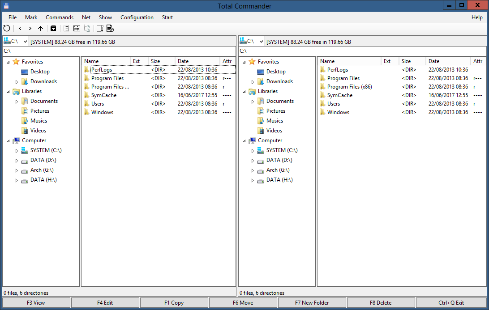
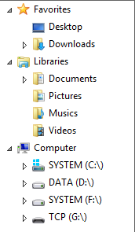
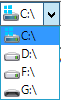
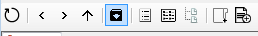
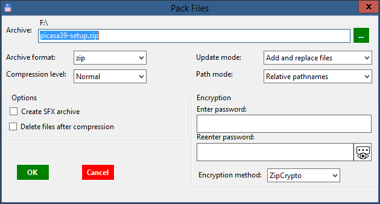

# FileBrowser

A faked Total Commander in C#

### Features

#### Support basic keyboard shortcuts on folder and file

Function (Shortcut) | How to implement
--------------------| ----------------
Copy (<kbd>Ctrl</kbd>+<kbd>C</kbd>) | Use Clipboard to create file list that needed to copy. In cut, use additional flag CanCut in order to delete file after Cut.
Move (<kbd>Ctrl</kbd>+<kbd>X</kbd>) | Like above
Paste (<kbd>Ctrl</kbd>+<kbd>V</kbd>) | Paste file and folder from list in Clipboard to target folder
Delete (<kbd>Delete</kbd> or <kbd>Shift</kbd>+<kbd>Delete</kbd>) (Many file and folder) | Use `Microsoft.VisualBasic.FileIO.FileSystem.DeleFile` and `FileSystem.DeleDirectory` to delete file and display familiar delete-file-prompt message box
Rename (<kbd>F2</kbd>) (Many file and folder) | Set `LabelEdit` attritube of `ListView` and implement handler for `AfterLabelEdit` event
Find (<kbd>Ctrl</kbd>+<kbd>F</kbd>) | Use seperate `FormFileFinds` form to search for files, where using `DirectoryInfo.GetFiles` and `DirectoryInfo.GetDirectories`
View in detail or in list | Set `View.Details` or `View.List`
Sort file in column | Implement handler for `ColumnClick` event with comparers such as `CompareFileName`, `CompareFileExtension`, `CompareFileSize`, etc
Use `VirtualListView` for faster display | Set `VirtualMode = true`, handlers for `CacheVirtualItems`, `RetrieveVirtualItem`, `SearchForVirtualItem`
Support Drop\&Drag | Implement handlers for `DragEnter`, `DragDrop`, `ItemDrag`
Support file browser history | In `ShellHistory` class

#### Clean user interface (UI) with 2 interactive windows

In fact, each window is a `UserControl`, mostly including other controls like `ListView`, `TextBox`, `ComboBox`, `TreeView`.

#### Browse in many local drives

#### Menu context and shortcuts to interact with file and folder

Key | Action
--- | ------
<kbd>F1</kbd> / <kbd>Ctrl</kbd>+<kbd>C</kbd> | Copy selected items
<kbd>F2</kbd> | Rename selected items
<kbd>F3</kbd> | View selected files
<kbd>F4</kbd> | Edit selected items
<kbd>F5</kbd> | Refresh file browser.
<kbd>F6</kbd> / <kbd>Ctrl</kbd>+<kbd>X</kbd> | Move selected items
<kbd>F7</kbd> / <kbd>Ctrl</kbd>+<kbd>Shift</kbd>+<kbd>N</kbd> | Create new folder
<kbd>F8</kbd> | Delete selected items
<kbd>Ctrl</kbd>+<kbd>V</kbd> | Paste files or folders.
<kbd>Ctrl</kbd>+<kbd>Q</kbd> | Exit the application.
<kbd>Alt</kbd>+<kbd>Enter</kbd> | Open properties dialog for selected items.
<kbd>Ctrl</kbd>+<kbd>F</kbd> | Search for files and folders.
<kbd>Alt</kbd>+<kbd>⇑</kbd> | Go to parent folder
<kbd>Backspace</kbd> / <kbd>Alt</kbd>+<kbd>⇐</kbd> | Go to previous folder.
<kbd>Alt</kbd>+<kbd>⇒</kbd> | Go to the following folder.
<kbd>Enter</kbd> | Open file or folder.
<kbd>Delete</kbd> | Send files or folders to Recycle bin
<kbd>Shift</kbd>+<kbd>Delete</kbd> | Permanently remove files or folders.

#### Edit, Run file directly with supported system formats such as MS Word, `.exe`

#### Compress file and folder

### TODO

- Add handler for menu bar
- Test suits
- Add Travis CI build tests
- Beautify [Keyboards.htm](TotalCommander/Keyboards.htm)

### Meta

- Written by @lzutao
- Release under [GPLv3 License](LICENSE)
- Software is as is - no warranty expressed or implied.
